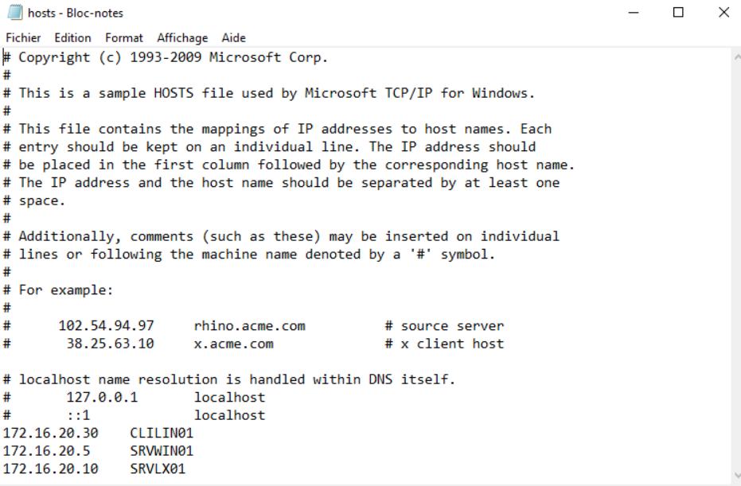

## Sommaire

### 1. [Prérequis technique](#prerequis-technique)  
   1.1 [Update et upgrade](#Update-et-upgrade)  
   1.2 [Paramétrage des IP](#Paramétrage-des-IP)  
         1.2.a [CLILIN01](#ubuntu)  
         1.2.b [CLIWIN01](#Client-Windows)  
         1.2.c [SRVWIN01](#Windows-Serveur-2022)  
         1.2.d [SRVLX01](#Serveur-Debian)  
         

   1.3 [Paramétrage du réseau](#Paramétrage-du-réseau)  
         1.3.a [CLILIN01](#ubuntu_reseau)  
         1.3.b [CLIWIN01](#Client-Windows_reseau)  
         1.3.c [SRVWIN01](#Windows-Serveur-2022_reseau)  
         1.3.d [SRVLX01](#Serveur-Debian_reseau)  
         
### 2. [Configuration SSH](#configuration-SSH)  
### 3. [Configuration WinRM](#configuration-WinRM)   
### — [FAQ](#FAQ) —


### 1. Prérequis techniques
<span id="prerequis-technique"></span>
  #### 1.1 Update et upgrade  
  <span id="Update-et-upgrade"></span>

Avant toute chose, pour les machines sous distribution GNU/Linux, vérifiez que vous avez la dernière version de paquets disponibles. Pour cela, rien de plus simple, il suffit d'entrer ces deux commandes :
``` sudo apt update ```
``` sudo apt upgrade ```

Vous êtes désormais à jour. 

  
  #### 1.2 Paramétrage des IP  
  <span id="Paramétrage-des-IP"></span>
Nous allons configurer les machines pour atteindre cette configuration finale : 

| Nom   | OS       | IP | DNS |
| :-: | :-: | :-: | :-: |
| CLILIN01 | Ubuntu 24.04 LTS | 172.16.20.30/24| 8.8.8.8 |
| CLIWIN01 | Windows 10 | 172.16.20.20/24| 8.8.8.8 |
| SRVWIN01 | Windows Server 2022 | 172.16.20.5/24| 8.8.8.8 |
| SRVLX01 | Debian 12.10 | 172.16.20.10/24| 8.8.8.8 |
  
   ##### 1.2.a CLILIN01  
   <span id="ubuntu"></span>

D'abord, paramétrons le client. Ici, nous utilisons la version Ubuntu 24.04.2 LTS. Vous pouvez le vérifier avec la commande
``` lsb_release -a ```

Nous allons dans les Paramètres; dans la rubrique Réseau; puis dans les options du réseau qui nous intéresse : ens18 en filaire. Il est possible de voir vos cartes réseau avec la commande 
``` ip l ```

Dans la rubrique IPv4, nous allons insérer une adresse IP et un masque. Dans notre cas, nous choisirons 172.16.20.30 et 255.255.255.0.  
Ajoutons ensuite la passerelle 172.16.20.254 et le DNS en 8.8.8.8.  
Ce qui devrait donner ceci :  
  
 
   ##### 1.2.b CLIWIN01  
   <span id="Client-Windows"></span>
   Nous allons dans les Paramètres, dans la rubrique Réseau et Internet, puis dans les Propriétés de Ethernet, nous allons modifier les Paramètres IP. Voici le résultat : 
   
 

   ##### 1.2.c SRVWIN01  
<span id="Windows-Serveur-2022"></span>

Enchaînons avec le Windows serveur. Dans Server Manager, allons dans la rubrique Local Server, puis cliquons sur l'extralien de Ethernet 2. Allons dans les propriétés d'Ethernet (click droit, Properties). Puis dans Internet Protocol Version 4 (TCP/IPv4). C'est ici que nous insérons l'addresse IP, le masque, la passerelle et le DNS. Le résultat suivant est ainsi obtenu :

  

   ##### 1.2.d SRVLX01  
   <span id="Serveur-Debian"></span>
         
Ici, nous utilisons la version Debian 12.10. Vous pouvez le vérifier avec la commande
``` cat /etc/debian_version ```
Le plus simple est de se connecter directement avec le compte root.  
Ensuite, modifions le fichier /etc/network/interfaces avec la commande ```nano /etc/network/interfaces```  
Configurez votre seconde carte réseau, en insérant l'adresse IP, le masque et la passerelle de la façon suivante :

 

Nous avons changé le "allow hotplug" en "auto" par mesure de précaution. Cela signalera d'activer la carte au branchement de celle-ci. ens18 étant le nom de la carte réseau, et également "dhcp" en "static" pour signaler une configuration manuelle. Une fois fait, vous pouvez enregistrer et quitter le fichier.

  #### 1.3 Paramétrage du réseau  
<span id="Paramétrage-du-réseau"></span>
   ##### 1.3.a CLILIN01  
<span id="ubuntu_reseau"></span>

Maintenant, établissons la connexion entre les machines. Pour cela, nous allons modifier le fichier /etc/hosts et y ajouter les adresses IP et les noms de machines correspondant. Pour cela, tapez la commande ```sudo nano /etc/hosts```. Dans notre cas, voici le résultat :

 

   ##### 1.3.b CLIWIN01  
   <span id="Client-Windows_reseau"></span>
Dans l'explorateur de fichiers, nous allons suivre le chemin suivant : C:\Windows\System32\drivers\etc pour ouvrir le fichier hosts. Ajoutons-y les adresses IP des autres machines :
   
 
 
   ##### 1.3.c Windows Serveur 2022  
<span id="Windows-Serveur-2022_reseau"></span>
Nous allons maintenant le faire sur le serveur Windows. Comme pour la machine cliente, dans l'explorateur de fichiers, nous allons suivre le chemin suivant : C:\Windows\System32\drivers\etc pour ouvrir le fichier hosts. Ajoutons-y les adresses IP des autres machines :

 


   ##### 1.3.d Serveur Debian  
<span id="Serveur-Debian_reseau"></span>
Nous allons procéder à la même chose sur le serveur Debian. Pour cela, même commande (le sudo n'est pas nécessaire si vous êtes sur le compte root) ```nano /etc/hosts```  
Vous pouvez maintenant ajouter les adresses IP des machines de votre futur réseau. 

 

### 2. Configuration SSH
<span id="configuration-SSH"></span>
Pour permettre de faire des commandes depuis la machine SRVLX01 sur la machine CLILIN01, nous allons avoir besoin du protocole SSH.
Le protocole SSH permet une connexion vers un utilisateur à distance sur la machine cible. Ici, nous voudrons nous connecter à l'utilisateur wilder sur la machine CLILIN01. L'utilisateur wilder faisant partie du groupe sudo, nous pourrons donc avoir les droits de super-utilisateur.

Première étape est d'installer le serveur OpenSSH via la commande :  
``sudo apt install openssh-server``

Suite à quoi nous allons forcer le démarrage du service SSH via la commande :  
``sudo systemctl start ssh``

Puis l'activer pour chaque prochain démarrage via la commande :  
``sudo systemctl enable ssh``

Il est possible de vérifier le statut est bien en enable par la commande :  
``sudo systemctl status ssh``

Il est possible de configurer le seveur SSH en modifiant le fichier ``etc/ssh/sshd_config``  
Il est par exemple possible de modifier le port d'écoute par défaut (qui est le 22) pour une meilleure sécurité (pas vraiment utile dans notre cas).  
Ou encore de configurer une clé SSH pour ne pas avoir à entrer le mot de passe de la session utilisée (ce ne sera pas fait non plus dans notre application)

Pour configurer le pare-feu à autoriser les connexions ssh, on applique la commande suivante :  
``sudo ufw allow ssh``

Tout est maintenant prêt à l'utilisation.

### 3. Configuration WinRM 
<span id="configuration-WinRM"></span>


-------------------
❓— FAQ —
<span id="FAQ"></span>
-------------------
**Q : Dois-je absolument exécuter apt update et apt upgrade avant ?**

> _Oui, ces commandes permettent de s'assurer que tous les paquets installés sont à jour, ce qui peut éviter certains conflits ou bugs pendant l'installation._

**Q : Que faire si la commande apt upgrade bloque ?**

> _Vérifiez qu’aucun autre gestionnaire de paquets (comme dpkg, apt, ou apt-get) n’est en cours. Utilisez sudo lsof /var/lib/dpkg/lock-frontend pour identifier le processus en cours. Pensez à vérifier que vous avez encore la place nécéssaire sur votre disque_

**Q : Puis-je utiliser d'autres adresses IP que celles indiquées dans le guide ?**

> _Oui, mais il faudra adapter toutes les configurations en conséquence (fichier hosts, pare-feu, scripts, etc.). Il est conseillé de suivre les IP proposées pour éviter les erreurs._

**Q : Comment vérifier que ma carte réseau s’appelle bien ens18 ?**

> _Utilisez la commande ip a ou ip link pour voir le nom de vos interfaces réseau_.

**Q : Je ne peux pas sauvegarder le fichier hosts sous Windows, que faire ?**

> _Lancez votre éditeur de texte (ex : Bloc-notes) en mode administrateur, puis ouvrez manuellement le fichier à partir de l’application._

**Q : Je n’ai pas les droits administrateur, puis-je tout de même suivre ce guide ?**

>  _Non, certaines opérations (modification réseau, fichier hosts, installation de paquets) requièrent des droits administrateur ou sudo._

**Q : Est-ce que ce guide fonctionne pour d’autres versions de Windows/Linux ?**

> _Il est testé pour Windows 10/Server 2022 et Ubuntu 24.04/Debian 12.10. D’autres versions peuvent fonctionner mais peuvent nécessiter des ajustements._

**Q : Pourquoi activer WinRM ?**

> _WinRM permet d’exécuter des commandes PowerShell à distance sur les machines Windows. C’est utile pour l’administration sans interface graphique._

**Q : Comment savoir si WinRM est bien activé ?**

> _Exécute winrm quickconfig dans une console PowerShell avec droits administrateur. Le message doit indiquer que WinRM est activé._

**Q : La commande ssh ne fonctionne pas, que faire ?**
> _Vérifie que le paquet openssh-server est bien installé (dpkg -l | grep openssh), que le service est actif (systemctl status ssh) et que le port 22 est ouvert (ufw status)._

**Q : J’ai une erreur "Permission denied" en SSH, que faire ?**
> Vérifiez que :
>- _L'utilisateur existe sur la machine distante._
>- _Vous utilisez le bon mot de passe_
>- _Le pare-feu est désactiver pour éviter les conflits avec les connexions SSH_

